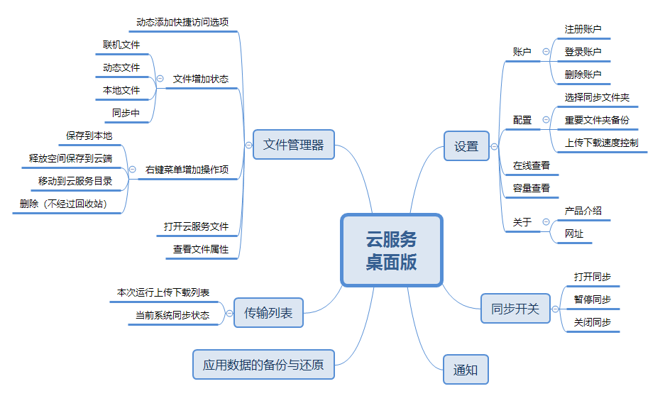
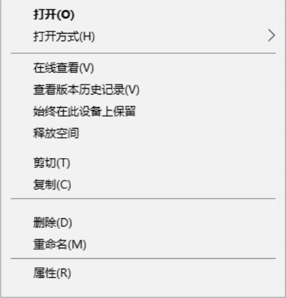

# 云服务概要设计

## 需求分析
|模块|功能|
|---|---|
|设置|容量使用情况、账号管理、重要文件夹备份、选择同步的文件夹、上传下载速度控制、关于，在线查看|
|同步开关|打开或者关闭同步，暂停同步2小时，8小时，24小时|
|文件管理器|打开本地文件管理器，并显示相应的文件夹，对应的，文件管理器要有相应的操作和提示|
|传输列表|可以很直观的按照时间顺序看到同步传输文件的情况|
|通知|如下载上传进度通知等|
|数据备份与还原|Android应用，系统配置的备份与还原|

## 各模块需求功能细分
#### 设置
设置主要分为以下几个功能：
- 是否开机启动
- 账户管理，提供五部分UI
  - 账号注册
    - 账号名称合法性验证
    - 密码安全性验证
    - 服务器地址选择（待确定）
    - 注册结果验证
      - 注册成功
      - 帐户名非法
      - 帐户名已被注册
      - 两次密码不一致
      - 网络问题
  - 账号登录
    - 账号名称合法性验证
    - 密码安全性验证
    - 地址选择（待确定）
    - 登录结果验证
      - 用户名或者密码错误
      - 网络问题
      - 登录成功
        - 文件管理器出现云服务侧边栏
        - 通知中心出现云服务图标
    - 忘记密码
  - 账号查看
    - 用户名查看
    - 服务器地址查看（待确定）
    - 修改密码（待确定）
    - 容量查看
    - 账户注销
    - 关于
  - 账号注销
    - 本地文件保留
    - 文件管理器云服务侧边栏消失
    - 通知中心云服务图标消失
  - 忘记密码
    - 账号名称合法性验证
    - 验证码
    - 新密码安全性验证
    - 修改结果验证
      - 用户名不存在
      - 验证码错误
- 选择同步的文件夹：表示该账户下所有文件同步到本地的哪个文件夹
- 容量查看（总容量，已使用容量）
- 重要文件夹备份，核心功能，主要包括桌面、文档、图片等文件夹，该功能是核心功能，详细如下：
  - 该设置为永久关联，一旦设置，即便重启系统，也会关联
  - 相应本地文件夹做出改变，云端也相应的做出改变
  - 同样的，云端做出改变，本地相应的文件夹也会做出改变
  - Openthos上应当实现应用配置的备份与还原，如浏览器书签，账户等，具体应用数据有如下内容
    - 系统账户
    - Openthos浏览器 书签，账户，历史访问，首页等配置
    - 文件管理器配置
    - 系统语言
    - 锁屏密码
    - 设置配置信息
    - 状态栏，开始菜单偏好
    - 已连接的WIFI
    - 壁纸
- 上传下载速度控制
- 关于，产品信息，网址等信息
- 在线查看，免登陆直接跳转到网页版，具体网页版查看云端根据需求来定

#### 同步开关
打开或者关闭同步，还可以暂停同步2小时，8小时，24小时

#### 文件管理器
  - 登录账户后，在文件管理器左侧快速访问条目中出现相应的图标，点击可立刻定位到设定的本地的同步文件夹，同时地址栏不显示真实地址，相比标准页面多了一栏状态，用来表示每个文件或者文件夹的当前状态。文件状态有以下四种：
  - 同步中（上传中）
  - 只保存在云端，称为联机文件，使用时需要下载
  - 云端一定有，本地不一定有，称为动态文件。这类文件会根据本地存储状态，动态的调整，下载后一定时间会再次变为联机文件
  - 本地和云端都有，无网也可以打开
- 根据文件状态来添加文件同步状态
- 添加右键云服务操作菜单

  - 标准页面主要功能有新建，删除，修改，重命名，复制，粘贴，剪切等，而云服务文件操作新增如下操作：保存到本地，释放空间保存到云端，云删除（不经过回收站），如：

（云服务文件同步处理有如下三种模式，需要确定）
- Android模式，根据需求来下载，上传文件
  - 优点
    - 节约空间，可以做到60%模仿OneDrive
  - 缺点
    - 需要三个以上Libiary来实现，分别用于普通存储，系统备份还原，重要文件夹备份
- PC模式，全部保存到本地
  - 优点
    - 方便访问
  - 缺点
    - 空间浪费
- 混合模式
  - 系统备份还原，重要文件夹备份采用PC模式
  - 普通存储采用Android模式
  - 代码复杂，同样需要三个以上Libiary来实现

#### 传输列表
每次开机可以看到本次同步进度和传输列表，退出后或重启系统消失，节约空间不作永久保存。

#### 通知
- 常驻当前状态
- 上传或下载时进度通知
- 同步出现问题后提示通知

#### 数据备份与还原
- 系统常规配置备份还原
- 系统浏览器个性化配置备份还原
- 其他应用备份还原

#### 其他
- 登录账户后，文件的右键菜单增加选项，移动到云服务同步文件夹，节约本地空间。直接移动到云服务同步文件夹的根目录下。
- 关闭云服务后，文件根据情况来提示，如果是联机文件，提示需要打开云服务才能正常查看，如果已经下载到本地了，则直接正常打开

## 对比Openthos2.0云服务、OneDrive和Seafile
Seafile先有Library，再有Library下的文件、文件夹；可以理解为Seafile是在本地维护了一个git，不断的联网检测服务器文件变化和本地的文件变化，如果发生了变化，则立刻同步，维持服务器和本地文件一致。Seafile同步上相比OneDrive，占用空间较多，如果选择不同步，则和本地文件夹没有关联，这样就达不到重要文件夹备份这一核心功能。

|功能|Openthos 2.0|Seafile|OneDrive|不支持原因|
|---|---|---|---|---|
|账户|✔|✔|✔||
|上传下转速度限制|✖|✔|✔|命令行没有相应接口|
|选择同步文件夹|✖|✔|✔|默认路径，不可更换|
|重要文件夹备份|✔|✖|✔|Seafile目标不在备份|
|在线查看|✔|✔|✔||
|容量查看|✖|✔|✔|只能在线查看|
|同步开关|✔|✔|✔||
|应用数据的备份与还原|✔|✖|✖|非系统应用没有权限|
|传输列表|✖|✔|✔|命令行没有相应接口|
|当前同步状态|✔|✔|✔||
|文件增加状态|✖|✔|✔|都在本地，没有必要|

## Openthos 2.0实现原理
Openthos2.0采用seaf-cli命令行方式来实现云服务，seaf-cli的原理是使用Python通过rpc来调用C/C++代码，由于Android上无法内置Python，使用了proot来运行。由于环境隔离，java与shell相互沟通，还需要通过IO来通信。整体来说，流程图如下：

## 未来云服务框架设计

某种程度上，仿照Seafile Windows版本的设计，系统维护Seafile-deamon的正常运行，应用层提供一个核心云服务，可以通过AIDL跨进程调用获取相应的数据或进行相应的操作；或者直接加载应用层云服务的界面、弹窗，来实现相应的功能。

