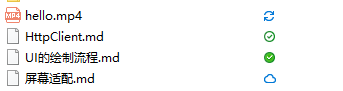
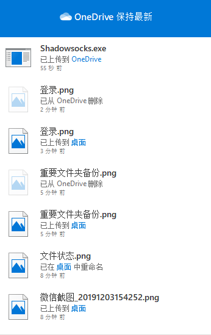

# OneDrive
OneDrive是微软新一代网络存储工具，由SkyDrive改名而来。OneDrive的版本跨越多个终端，包括移动端、PC端两大平台，并拥有网页版。这里测试的是PC端

## PC端
- 版本：19.192.0926.0012
- 平台：Windows 10

### 需求设计
|模块|功能|
|---|---|
|设置|容量使用情况、账号管理、重要文件夹备份、选择同步的文件夹、上传下载速度控制、关于|
|同步开关|打开或者关闭同步，暂停同步2小时，8小时，24小时|
|打开本地文件夹|打开本地文件管理器，并显示相应的文件夹|
|在线查看|打开网页直接查看服务器上文件内容，等同于免登陆直接跳转到网页版|
|传输列表|可以很直观的按照时间顺序看到OneDrive传输文件的情况|

#### 设置
设置主要分为以下几个功能
- 是否开机启动
- 账户管理，包含登录、注销等页面
- 容量查看（总容量，已使用容量）
- 选择同步的文件夹：表示该账户下所有文件同步到本地的哪个文件夹
- 重要文件夹备份
- 上传下载速度控制
- 关于

#### 账户设置
有独立的页面用来登录、注册或者注销，登录成功后，文件管理器左侧快速访问条目中出现相应的图标，用来快捷访问

#### 重要文件夹备份
主要包括桌面、文档、图片等文件夹，该功能是核心功能。
- 该设置为永久关联
- 相应本地文件夹做出改变，云端也相应的做出改变
- 同样的，云端做出改变，本地相应的文件夹也会做出改变
- Openthos上应当事先应用配置的备份，如浏览器书签，账户等

#### 同步开关
打开或者关闭同步，还可以暂停同步2小时，8小时，24小时

#### 打开本地文件夹
登录账户后，在文件管理器左侧快速访问条目中出现相应的图标，点击可立刻定位到设定的本地的同步文件夹，同时地址栏不显示真实地址，相比标准页面多了一栏状态，用来表示每个文件或者文件夹的当前状态。文件状态有以下四种：
- 同步中（上传中）
- 只保存在云端，称为联机文件，使用时需要下载
- 云端一定有，本地不一定有，称为动态文件。这类文件会根据本地存储状态，动态的调整，下载后一定时间会再次变为联机文件
- 本地和云端都有，无网也可以打开

为了节省空间，主要存储方式为联机文件和动态文件两种。状态图标如下图所示：

标准页面主要功能有新建，删除，修改，重命名，复制，粘贴，剪切等

#### 在线查看
免登陆直接跳转到网页版，具体网页版查看云端根据需求来定

#### 传输列表
每次开机可以看到本次同步进度和传输列表，退出后或重启系统消失，节约空间不作永久保存。

#### 其他
- 登录账户后，文件的右键菜单增加选项，移动到OneDrive，节约本地空间。直接移动到OneDrive的根目录下。
- 关闭云服务后，文件根据情况来提示，如果是联机文件，提示需要打开云服务才能正常查看，如果已经下载到本地了，则直接正常打开

# 对比Seafile和OneDrive，Seafile的不足
Seafile先有Library，再有Library下的文件、文件夹；可以理解为Seafile是在本地维护了一个git，不断的联网检测服务器文件变化和本地的文件变化，如果发生了变化，则立刻同步，维持服务器和本地文件一致。Seafile同步上相比OneDrive，占用空间较多，如果选择不同步，则和本地文件夹没有关联，这样就达不到重要文件夹备份这一核心功能。
